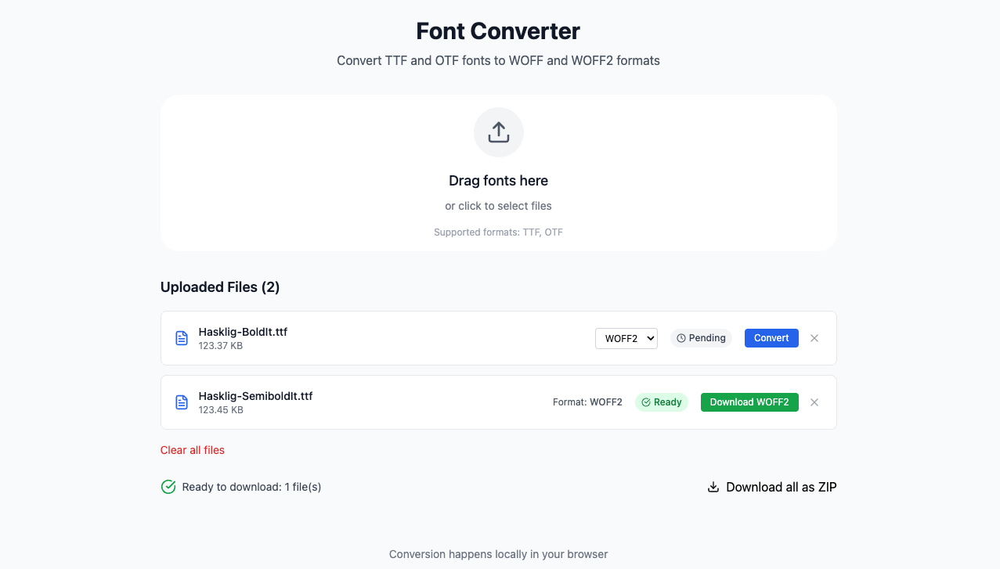

#! Font Converter (TTF/OTF → WOFF/WOFF2)
> A lightweight web application built with Nuxt 4 and Tailwind CSS that converts TrueType (TTF) and OpenType (OTF) fonts into optimized WOFF and WOFF2 formats entirely in your browser.

## 🚀 Features


- Upload multiple `.ttf` / `.otf` font files via drag & drop
- Select output format (WOFF or WOFF2) per file
- Non-blocking conversions using a Web Worker
- Instant download of individual fonts
- Download all converted fonts as a single ZIP archive
- Real-time progress indicator
- Built with Nuxt 4, Pinia, Vite, Tailwind CSS



```bash
# npm
npm install

# pnpm
pnpm install
```

## 📦 Tech Stack
- **Framework:** Nuxt 4 (Vue 3)
- **State Management:** Pinia
- **Styling:** Tailwind CSS
- **Build Tool:** Vite
- **Worker:** Web Worker + pako (zlib)
- **Zip:** JSZip
- **File Saving:** FileSaver.js

```bash
# npm
npm run dev

# pnpm
pnpm dev
```

## 💻 Installation
```bash
git clone <repository-url>
cd nuxt-fonts
pnpm install
```

```bash
# npm
npm run build

# pnpm
pnpm build
```

Locally preview production build:

```bash
# npm
npm run preview

# pnpm
pnpm preview
```

## 🧑‍💻 Development
```bash
pnpm dev
```
Open your browser at `http://localhost:3000` (or the displayed port)

## 📈 Usage
1. Drag & drop `.ttf` / `.otf` files into the drop zone.
2. Select WOFF or WOFF2 format for each file.
3. Click **Convert** to generate the font.
4. Download individual fonts upon completion or click **Download All** to get a ZIP.

## 🛠 Production Build
```bash
pnpm build
pnpm preview
```

## 🤝 Contributing
Contributions, issues, and feature requests are welcome!

## 📄 License
MIT License
